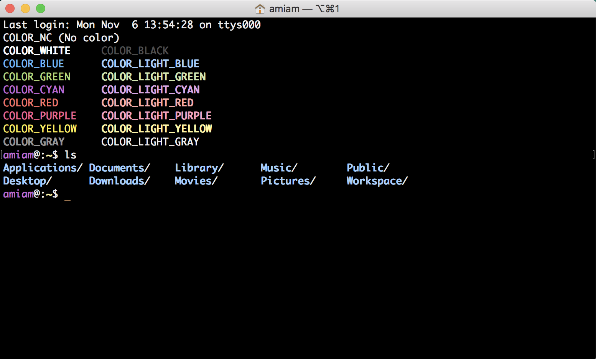

# Material Black - Readble Terminal Theme in Mac OS X, with Material Colors



## Theme Setting method - テーマの設定方法

Donwload "Material Black.terminal".

Click Image.

[](https://youtu.be/zBK34oHMU1c)

##  My Custmize


bash_profile
```
$ export PS1="\[\033[36m\]\u\[\033[m\]@:\[\033[33;1m\]\w\[\033[m\]\$ "
$ export CLICOLOR=1
$ export LSCOLORS=ExFxBxDxCxegedabagacad
$ alias ls='ls -GFh'
```

### What is this?

[export PS1="..."](https://gist.github.com/hrdtbs/e5327525f84cf3fa9efb7f33ae44bab6#file-ps1-md)

[export CLICOLOR=1](https://gist.github.com/hrdtbs/e5327525f84cf3fa9efb7f33ae44bab6#file-clicolors-md)

[export LSCOLORS=...](https://gist.github.com/hrdtbs/e5327525f84cf3fa9efb7f33ae44bab6#file-lscolors-md)

[alias ls='ls -GFh'](https://gist.github.com/hrdtbs/e5327525f84cf3fa9efb7f33ae44bab6#file-ls-gfh-md)